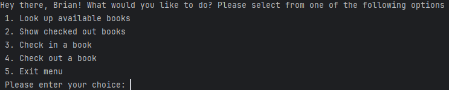
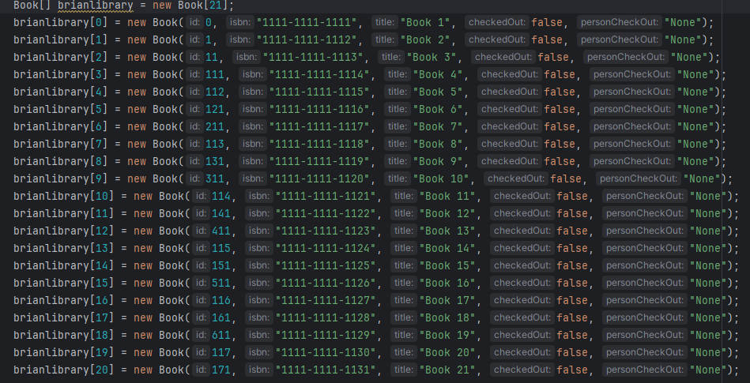
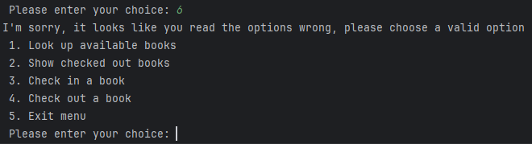

# Neighborhood Library
A display of the main menu functionality:

# Available Books
This a mock-up of the library with placeholder names and information:

# Error Handling

When an invalid option is input, it will display an error and loop back to the menu

# Interesting Piece of Code

Here I am utilizing a loop to initialize the array

